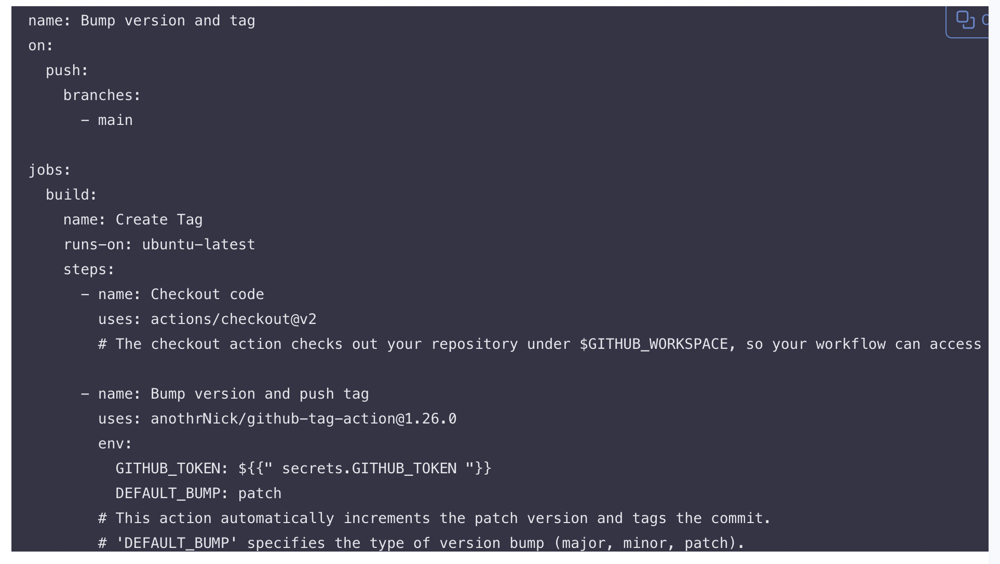
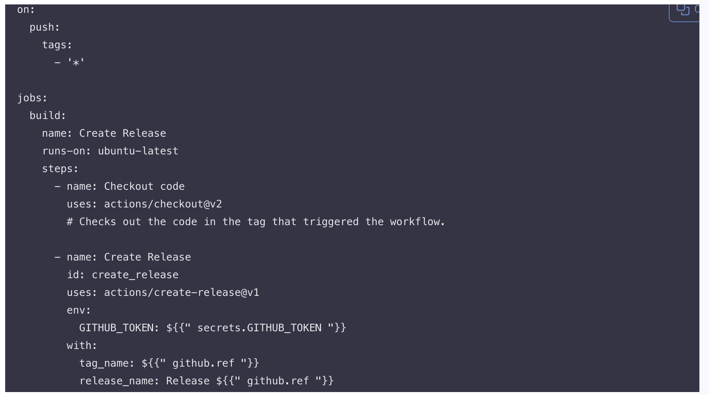

#### GitHub Actions and CI/CD Course: Deployment Pipelines and Cloud Platforms 

### Introduction to GitHub Actions Course: Deployment and Cloud Integration

Comprehensive course on GitHub Actions, focusing on deployment pipelines and cloud platform integration. In this coourse we're going to explore how to  leverage GitHub Actions to automate deployment processes, effectively pushing application to various cloud environments. Whether you're a budding developer, a seasoned engineer, or anyone interested in the world of DevOp course is tailored to provide us with practical skills and insights into the world of continuous integration, continuous deployment, and cloud services.

## Pre-requisites 

1. GitHub Account: Necessary for managing repositories and setting up GitHub Actions.

2. Basic Knowledge of Git: Understanding of Git for version control. Installation guide: Git Installation.

3. Familiarity with YAML: Understanding YAML syntax for writing GitHub Actions workflows.

4. Experience with Cloud Platforms (AWS, Azure, or GCP): Basic knowledge of the chosen cloud platform for deployment.

5. Understanding of CI/CD Concepts: Familiarity with Continuous Integration and Continuous Deployment processes. Resource: CI/CD Introduction.

6. Node.js and npm Installed (for Node.js based projects): Knowledge of Node.js for running JavaScript server-side.
   Node.js: Download and Installation. Verify installation: Run `node -v` and `npm -v in the terminal.

7. Access to a Code Editor or IDE: A text editor or Integrated Development Environment (IDE) like Visual Studio Code, Atom, or Sublime Text.
   Visual Studio Code: Download VS Code.

8. Basic Knowledge of Software Deployment: Understanding the basics of deploying applications, especially in a cloud environment. 
   Resource: Introduction to Software Deployment.

9. Internet Connection: Required for accessing GitHub, cloud platforms, and online resources.

 
### Introduction to Deployment Pipelines 

## Objectives: 

- Defining and understanding the stages of a deployment pipeline. 

- Learning about different deployment strategies. 

## Details: 

## 1. Defining Deployment Stages: 

- Development: Writing and testing code in a local 

- Environment. Integration: Merging code changes to a shared branch.

- Testing: Running automated tests to ensure code quality. 

- Staging: Deploying code to a production-like environment for final testing.

- Production: Releasing the final version of your code to the end-users.

 ## 2. Understanding Deployment Strategies:
 
 - COURSE Blue-Green Deployment: Running two production environments, only one of which serves end-users at any time.
 
 - Canary Releases: Rolling out changes to a small subset of users before full deployment.
 
 - Rolling Deployment: Gradually replacing instances of the previous version of an application with the new version. 
 

 ## Automated Releases and Versioning 
 
 ## Objectives:
 
 - Automate versioning in the CI/CD process. 

 - Create and manage software releases.

 ## Automating Versioning in CI/CD:
 
  1. Semantic Versioning: 
  
 - Use semantic versioning (SemVer) for your software. It uses a three-part version number, for example, `MAJOR.MINOR.PATCH. 

  2. Automated Versioning with GitHub Actions: 
  
 - Implement automated versioning using GitHub Actions to increment version numbers automatically based on code changes. 
 
 
 ## Example snippet for a versioning script in GitHub Actions:

- This action will automatically increment the patch version and create a new tag each time changes are pushed to the main branch.

## Creating and Managing Releases: 

1. Automating Releases with GitHub Actions:

Set up GitHub Actions to create a new release whenever a new tag is pushed to the repository. 

## Example snippet to create a release:

- The `actions/create-release@v1` action is used to create a release on GitHub. It uses the tag that triggered the workflow to name and label the release.

## Deploying to Cloud Platforms 

## Objectives: 

- Deploy applications to popular cloud platforms using GitHub Actions. 

- Configure deployment environments.